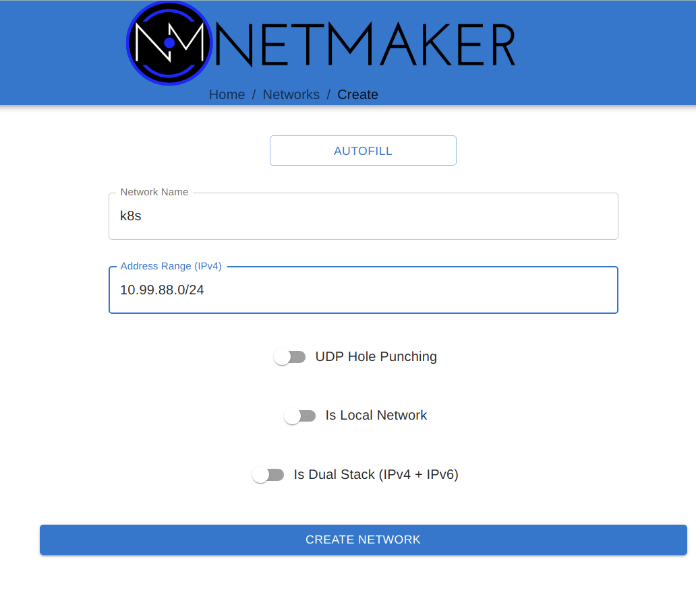
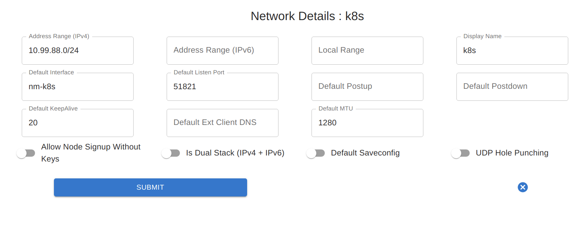
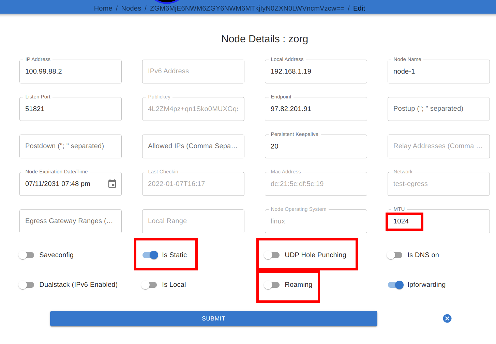

============
Deployment
============

This page covers the general guidance for the 3 stages of a Netmaker deployment: Server Installation, Network Creation, and Client Installation

1) Server Installation
====================================

Considerations
----------------

It is typically recommend to deploy the Netmaker server either on its own VM, or on a dedicated "management" cluster. The Netmaker server acts best when it is in a dedicated environment. This avoids interference by separating it from the "managed" environments.

In most scenarios, the Netmaker server should not run inside a cluster where it will also be configuring the cluster network. If a failure occurs and the Netmaker server runs inside of the cluster, then the Netmaker server will become unreachable for debugging, making the fix much more difficult.

Except in special circumstances, the best place for the Netmaker server is a dedicated, globally accessible location.

Installation
---------------

With the above guidance in mind, there are several ways to install the server, based on the environment and how you wish to maintain your server.

`For Trials, PoC's, and Experimenting <https://github.com/gravitl/netmaker/tree/master#get-started-in-5-minutes>`_ - Use this if you are just looking to try out Netmaker. 

`For Small Deployments (Single Server, Non-HA) <https://docs.netmaker.org/quick-start.html>`_ - Use this if you are deploying for yourself or a small team.

`For a Highly Available Server on Kubernetes <https://docs.netmaker.org/server-installation.html#highly-available-installation-kubernetes>`_ - Use this if deploying on K8S (again, we recommend a dedicated cluster).

`For a Highly Available Server (non-K8S) <https://docs.netmaker.org/server-installation.html#highly-available-installation-vms-bare-metal>`_ - Use this if you need HA but don't want a dedicated cluster.

2) Network Creation
=====================

After deploying your Netmaker server via Step #1, you will need to navigate to your dashboard, and will be directed to create a user.

After creating a user and logging in, you will then need to create a network in order to set up your Kubernetes use case.

The Primary consideration here is that typically, UDP Hole Punching is not necessary. Why? Because Kubernetes nodes tend to be statically defined servers with dedicated IPs. We are not expecting them to move frequently, change addresses or be behind separate NAT's. Because of this, we recommend keeping UDP Hole Punching switched off. 

The other necessary consideration is address range. Make sure to choose an address range that will not conflict with:

a) The Kubernetes host subnet
b) The Kubernetes service network
c) The Kubernetes pod network

Outside of this, any (private) address range should work.

After creating your network, you may want to change a few default settings to make it more Kubernetes-friendly.

Primarily, if deploying into containers on top of the cluster, you may want to change the MTU and the default port. Running in containers which go through multiple layers of traffic routing can lead to a larger MTU failing in some scenarios. 1024 is often a good number.

In addition, consider changing the default port. If deploying onto containers using NodePorts, the default of 51821 is too high, since NodePorts use 30000-32767. 31821 might be a good default port to choose.

3) Client Installation
======================================

Once a network has been created, it's time to add nodes to the network.

Considerations
---------------

For Kubernetes scenarios, the client can be installed:

1) Directly on the host as a binary + service

2) As a container on the cluster

Option #1 is only necessary when building distributed clusters. This is because the virtual network must be created before the cluster is installed, so the netclient can't be deployed to a container on the cluster yet. The Cluster/CNI is then configured during installation to use the interface created by the netclient for intra-cluster networking.

For all other scenarios (remote access, multi-cluster networking, etc), we recommend deploying the client via containers. In some situations this will be a daemonset, and in others, it will be a standalone container on a dedicated host (usually for gateways).

The following is guidance for those two primary methods.

Binary on Host (pre-K8S)
---------------------------------

Regular client install instructions can be followed here: https://docs.netmaker.org/getting-started.html#deploy-nodes 

More detailed client install instructions can be found here: https://docs.netmaker.org/client-installation.html

After the client has been installed, you may want to change some of the node settings. For instance, if the node is expected to maintain a constant IP address, it may be best to turn off "Roaming" and turn on "Is Static". You may also want to reduce MTU (if you're not getting a connection), change the port (if there's a conflict), or even change the endpoint, if you'd prefer intra-cluster traffic to occur over a different address range.

Containerized (post-K8S)
-------------------------------

To deploy in a container, you will need a manifest. Examples can be found here: https://github.com/gravitl/netmak8s

If deploying a daemonset to encompass all (or most) nodes, use netclient-daemonset.yml as the basis. You will need to insert a key (TOKEN_VALUE), and change the netclient image tag to the appropriate version (e.g. v0.9.3).

If deploying a gateway, use netclient-gateway.yml as the basis. You will need to insert a key (TOKEN_VALUE), and change the netclient image tag to the appropriate version (e.g. v0.9.3).

There are various ways these manifests can be modified to match various scenarios which you should be aware of:

**Port:** Rather than specify a port, UDP Hole Punching can be used. In this case, the fields for NETCLIENT_IS_STATIC, NETCLIENT_ROAMING, NETCLIENT_PORT, and NETCLIENT_ENDPOINT can be left blank. For typical deployments, we recommend leaving these fields set.

**NodePort:** In some scenarios, you will want to pair a NodePort with the Port. For instance, if you cannot deploy the netclient with host privileges/networking, you can remove these privileges in the manifest, expose the port on the pod, and create a NodePort service that will route traffic to the pod. In such a scenario we recommend using 31821 as the Port for WireGuard in the manifest. You should then use the **same** NodePort to map to the DaemonSet. Here is an example manifest: https://raw.githubusercontent.com/gravitl/netmak8s/main/nodeport-example.yaml 

**Kernel WireGuard:** The container ships with wireguard-go, which is slower than kernel WireGuard. Often, a DevOps engineer or Developer will not have control over the underlying infrastructure. If it's a cloud provider k8s distribution, even the operations team often cannot do much about OS-level dependencies. However, if you do have the option to SSH into the host machines and install software, it is preferable to have kernel WireGuard installed.

In such cases, after installing kernel WireGuard on the host (e.g. `apt install wireguard wireguard-tools`), you can use the kernel versions of the manifests (netclient-gateway-kernel.yml and netclient-daemonset.yml)

For DigitalOcean, we also have a manifest that will both deploy the netclient and a WireGuard controller, which will install WireGuard on the host whenever it is not present. Something similar can be done for other cloud providers, but you must know the correct commands to run in order to install WireGuard (must know underlying OS). Then you can simply modify the script (inline in the yaml) to install on your cloud: https://github.com/gravitl/netmaker/blob/master/kube/netclient-template-doks.yaml 

